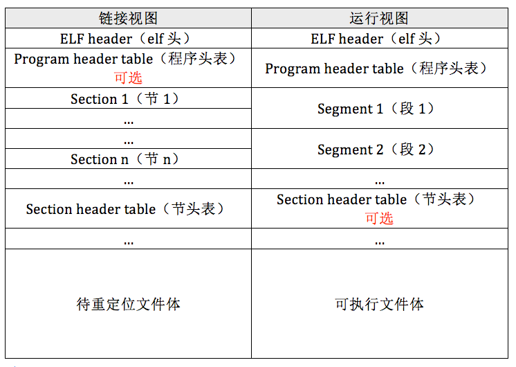

非常好，这次我们聚焦在——
💡 **ELF 格式的二进制文件（ELF Executable File）**。

---

## 🧩 一、什么是 ELF？

**ELF (Executable and Linkable Format)** 是 Linux（以及大多数 Unix 系统）使用的 **可执行与可链接文件格式**，
它统一了以下几种文件类型：

| ELF 类型                | 说明                                   |
| ----------------------- | -------------------------------------- |
| **可重定位文件 (.o)**   | 编译后未链接的目标文件，用于静态链接。 |
| **可执行文件 (无后缀)** | 可以被操作系统直接执行的程序。         |
| **共享目标文件 (.so)**  | 动态链接库。                           |
| **核心转储文件 (core)** | 程序崩溃时生成，用于调试。             |

---

## 🧱 二、ELF 文件的整体结构

下图是 ELF 文件的逻辑布局（从文件开头到结尾）：

```
+---------------------+
| ELF Header          |  → 文件头，描述整个文件布局
+---------------------+
| Program Header Table|  → 程序运行时加载信息（段）
+---------------------+
| Section 1 (.text)   |  → 代码段，机器指令
+---------------------+
| Section 2 (.data)   |  → 已初始化的全局变量
+---------------------+
| Section 3 (.bss)    |  → 未初始化全局变量（只占空间）
+---------------------+
| Section 4 (.rodata) |  → 常量字符串等只读数据
+---------------------+
| ...                 |
+---------------------+
| Section Header Table|  → 各节区的元信息（编译器/链接器用）
+---------------------+
```

---

## 📖 三、主要组成部分详解

### 1️⃣ ELF Header（文件头）

**文件开头的 64 个字节左右**，描述整个 ELF 文件的类型与结构。

| 字段            | 说明                                          |
| --------------- | --------------------------------------------- |
| `e_ident[0..3]` | 魔数 `0x7F 'E' 'L' 'F'`                       |
| `e_type`        | 文件类型：可执行/重定位/共享库 **2 为可执行** |
| `e_machine`     | 目标架构（x86、x86-64 等）                    |
| `e_entry`       | 程序入口地址（如 `_start`）                   |
| `e_phoff`       | 程序头表偏移                                  |
| `e_shoff`       | 节区头表偏移                                  |
| `e_phnum`       | 程序头数量                                    |
| `e_shnum`       | 节区数量                                      |

📌 **举例：**

```bash
readelf -h /bin/ls
```

输出中可以看到：

```
Entry point address: 0x402400
Start of program headers: 64 (bytes into file)
Number of section headers: 30
```

---

### 2️⃣ Program Header Table（程序头表）

由内核加载器使用，描述“哪些部分要加载到内存”。

每一项称为 **Program Header Entry**，定义一个**段（Segment）**。

| 字段       | 含义                         |
| ---------- | ---------------------------- |
| `p_type`   | 段类型（可加载、动态信息等） |
| `p_offset` | 文件中偏移                   |
| `p_vaddr`  | 虚拟地址                     |
| `p_filesz` | 文件中该段长度               |
| `p_memsz`  | 内存中长度                   |
| `p_flags`  | 访问权限（R/W/X）            |

⚙️ 加载时，内核会按照这些段信息把 `.text`、`.data` 等部分映射到进程虚拟内存。

---

### 3️⃣ Section（节区）

编译器、链接器关心的“逻辑部分”，例如：

| 节区名      | 含义                           |
| ----------- | ------------------------------ |
| `.text`     | 机器指令（代码）               |
| `.data`     | 已初始化全局变量               |
| `.bss`      | 未初始化全局变量（运行时清零） |
| `.rodata`   | 只读常量数据                   |
| `.symtab`   | 符号表                         |
| `.rel.text` | 重定位信息                     |
| `.strtab`   | 字符串表                       |

可以用：

```bash
readelf -S a.out
```

查看节区列表。

---

### 4️⃣ Section Header Table（节区头表）

描述每个 Section 的偏移、大小、属性，是链接器用的，不用于运行时加载。

---

## ⚙️ 四、运行时加载过程（内核视角）

当你执行 ELF 程序时：

1️⃣ Shell 调用 `execve()` 系统调用；
2️⃣ 内核读取 ELF Header，识别为 ELF 文件；
3️⃣ 解析 Program Header Table；
4️⃣ 将各段（Segment）映射到进程虚拟内存（如 `.text` → 可执行、`.data` → 可写）；
5️⃣ 设置栈空间与参数；
6️⃣ 跳转到入口地址 `e_entry` 执行 `_start`。

---

## 🧠 五、简单示例：分析一个 ELF 文件

```bash
$ gcc hello.c -o hello
$ readelf -h hello
```

输出摘要：

```
ELF Header:
  Class:                             ELF64
  Type:                              EXEC (Executable file)
  Machine:                           Advanced Micro Devices X86-64
  Entry point address:               0x401040
```

查看段：

```bash
$ readelf -l hello
```

可以看到：

```
LOAD 0x000000 0x00400000 0x00400000 R E 0x1000
LOAD 0x001000 0x00600000 0x00600000 RW  0x2000
```

表示 `.text` 段从文件偏移 `0x0` 加载到虚拟地址 `0x400000`。

---

## 📊 六、ELF 与 `.bin` 的区别总结

| 项目                   | ELF 文件                     | 纯二进制 `.bin`            |
| ---------------------- | ---------------------------- | -------------------------- |
| 有文件头               | ✅ 有 ELF Header             | ❌ 无                      |
| 包含段表/节区表        | ✅ 有                        | ❌ 无                      |
| 可直接由内核加载       | ✅ 是                        | ❌ 否                      |
| 人类可读性（分析工具） | ✅ 支持 `readelf`, `objdump` | ❌ 纯机器码                |
| 用途                   | Linux 用户程序、库           | Bootloader、内核、裸机程序 |

---

✅ **一句话总结：**

> ELF 是一种“带说明书的二进制文件”，
> 它告诉操作系统——这个程序的每一段该放在哪里、怎么执行；
> 而 `.bin` 是“纯原料”，没有说明书，只能靠人工加载和运行。

---

-   ELF 格式的作用体现在两方面，一是链接阶段，
    另一方面是运行阶段


