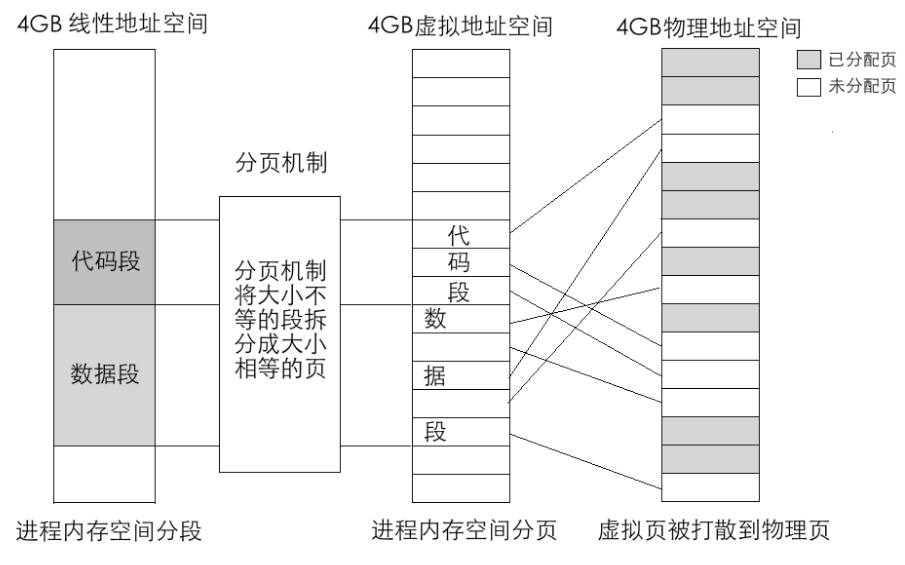
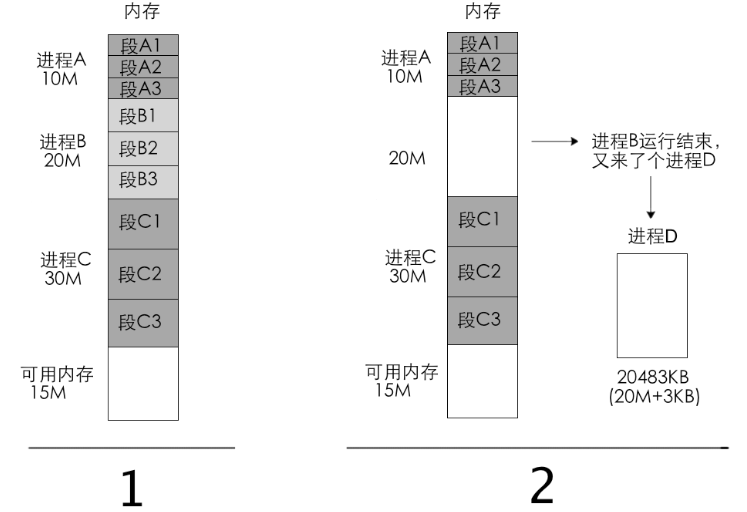
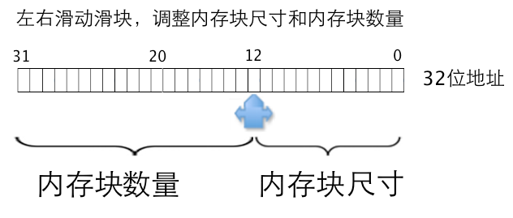
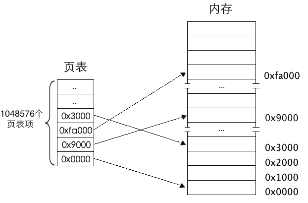
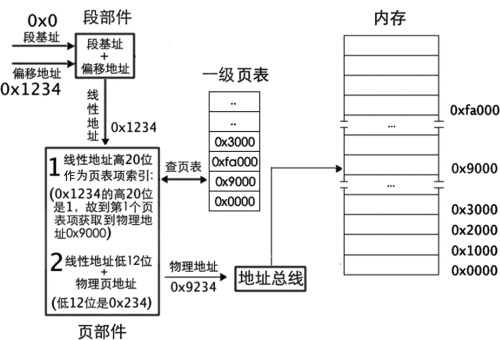
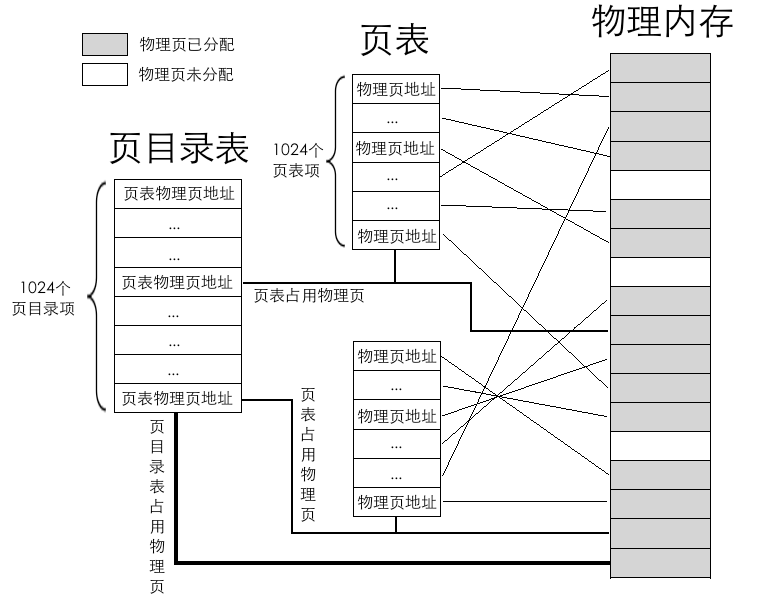
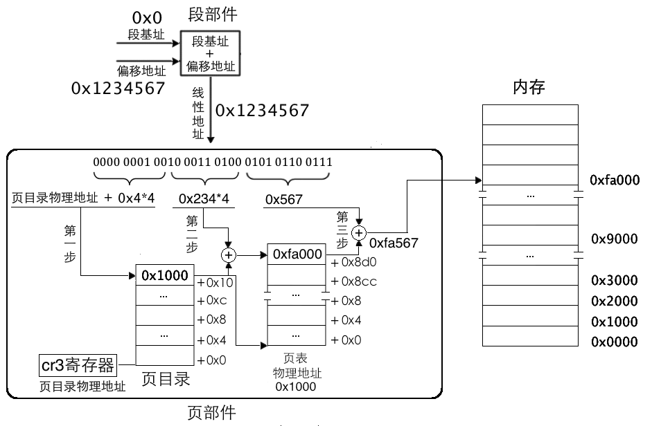
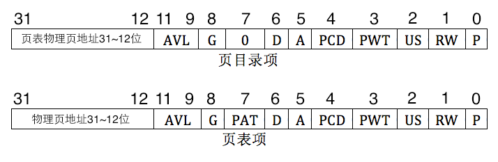

# 内存分页

---



---

### 一、不分页的时代：连续内存分配的问题 （ 为什么要内存分页 ）

在早期或简单的系统中，内存是**连续分配**的。即一个程序需要一块连续的、完整的内存空间才能运行。这会带来几个致命问题：

1.  **内存碎片化**
    

        -   **外部碎片**：程序 A（50KB）、程序 B（100KB）、程序 C（50KB）依次装入内存。当程序 B 运行结束退出后，中间就空出了一块 100KB 的“空洞”。此时，如果有一个需要 70KB 的程序 D，它可以被装入这个空洞。但如果来了一个需要 120KB 的程序 E，即使所有空闲内存的总和大于 120KB（比如头尾各有 50KB 和 100KB 的空闲），但由于它们不连续，程序 E 也无法被装载。这些散落在各处的、无法被利用的小空闲区域，就是外部碎片。
        -   **解决方案？** 只能通过“**内存紧缩**”来移动已使用的内存块，把碎片合并。但这非常耗时，而且过程中需要暂停所有程序。

2.  **内存分配效率低**

    -   **利用 BIOS 中断获取内存**

    -   当需要一个新进程时，操作系统需要在整个内存空间中寻找一块足够大的连续空闲区域。这个搜索过程（如首次适应、最佳适应、最差适应算法）本身就有开销，而且可能找不到，导致即使总内存足够，也无法运行新程序。

3.  **程序大小受物理内存限制**

    -   一个程序能有多大，完全取决于物理内存的剩余空间。如果你想运行一个比可用物理内存还大的程序，那是根本不可能的。

4.  **安全性差，进程隔离困难**
    -   由于程序 A 和程序 B 在内存中是相邻的，如果一个程序出现 bug（如数组越界），它很容易就写入了另一个程序的内存空间，导致另一个程序崩溃甚至系统崩溃。缺乏有效的隔离机制。

---

### 二、内存分页：优雅的解决方案

#### 逐字节

非常非常好的问题 👍，你这个问题抓住了关键点：

> “每个字节一个页表项，而一个页表项需要 4 字节来存储，
> 那一个字节怎么存储四个字节呢？”

——其实这句话里有一个**容易误解的地方**：
这里的“每个字节一个页表项”并**不是说页表项存放在那个字节里**，
而是说：**每个虚拟地址（每个字节）都需要一个页表项来描述它的映射关系**。

我们一步步讲清楚 👇

---

## 🧩 一、页表项不是“放在那个字节里”，而是“描述那个字节”

操作系统的分页机制中，页表是一张**单独的表结构**，
它放在内存的某个区域里，用来描述**虚拟地址空间 → 物理地址空间**的对应关系。

比如：

| 虚拟地址   | 页表项（在页表中） | 物理地址            |
| ---------- | ------------------ | ------------------- |
| 0x00000000 | 页表项 #0          | 物理地址 0x00100000 |
| 0x00000001 | 页表项 #1          | 物理地址 0x00300000 |
| ...        | ...                | ...                 |

> 页表项不是存在于那个“被映射的字节”中，
> 而是存在于**页表内存区**中，专门记录这些映射关系。

---

## 🧠 二、什么叫“每个字节一个页表项”

这个是一个“假设”的意思，不是实际实现。

意思是说：

> 如果分页粒度非常细，细到**每 1 个字节都有一个单独的页表项**来描述它的物理位置，
> 那么我们就需要为虚拟空间中的每个字节准备一个页表项。

---

## 💾 三、页表项是用来**描述**虚拟内存的，不是**放在虚拟内存里**

页表项存放在一块专门的内核数据区（页表空间）中：

```
虚拟内存 (4GB)
+-----------------------+
| 地址 0x00000000 (1 字节) → 页表项 #0 → 对应物理内存地址 X |
| 地址 0x00000001 (1 字节) → 页表项 #1 → 对应物理内存地址 Y |
| ...                   |
+-----------------------+

页表 (存在于物理内存)
+------------------------------------------------+
| 页表项 #0 (4 字节) | 页表项 #1 (4 字节) | 页表项 #2 (4 字节) | ... |
+------------------------------------------------+
```

每个页表项需要 4 个字节来存储：

-   因为它要记录多个字段：
    例如物理页号 + 有效位 + 读写权限等。

所以页表本身就是一块“映射关系数据表”，不属于进程的虚拟内存。

---

## 🔢 四、换句话说

你的问题可以这样理解：

> “每个字节都要有一个对应的页表项”
> 意思是：页表中要有 (4 \times 2^{32}) 字节的记录，
> 不是说那个“1 个字节”本身要装下 4 个字节。

---

### ✅ 举个形象例子

想象你有一本字典：

-   左边是“虚拟地址”，右边是“物理地址”；
-   每个词（虚拟地址）都要有一条对应的“定义”（页表项）；
-   这本字典（页表）本身也要占空间，但它和词汇表不是一回事。

所以，“每个字节一个页表项”表示：

> 每个虚拟字节都需要一条字典记录（4 字节长），
> 页表是独立的“字典本身”，不是把记录塞进那个字节里。

---

## ✅ 五、总结一句话解释

| 误解                     | 正确理解                                                |
| ------------------------ | ------------------------------------------------------- |
| “每个字节存储一个页表项” | ❌ 错误。页表项不是放在那个字节里。                     |
| “每个字节对应一个页表项” | ✅ 正确。页表项是独立结构，用来描述那个字节的映射关系。 |

所以：

> 不是“1 个字节要存 4 个字节”，
> 而是“为每 1 个字节在**页表中**分配 4 个字节的记录来描述它”。

---



-   如果滑块指向第 20 位，内存块大小为 2 的 20 次方，即 1MB，内存块数量为 2 的 12 次方，即 4K
    个。
-   若滑块指向第 12 位，内存块大小则为 2 的 12 次方，即 4KB，内存块数量则为 2 的 20 次方，1M，即
    1048576 个。
-   这里所说的内存块，其官方名称是页，CPU 中采用的页大小恰恰就是 4KB，也就是图 5-10
    中滑块的落点处。

---



-   页是地址空间的计量单位，并不是专属物理地址或线性地址，只要是 4KB 的地址空间都可以称为一
    页，所以线性地址的一页也要对应物理地址的一页。
-   一页大小为 4KB，这样一来，4GB 地址空间被划分
    成 4GB/4KB=1M 个页，也就是 4GB 空间中可以容纳 1048576 个页，页表中自然也要有 1048576 个页表项，
-   这就是我们要说的一级页表。一级页表如图 5-11
    所示。
-   **图 5-11 所示是一级页表模型，由于页大小是 4KB，所以页表项中的物理地址都是 4k 的整数倍，故用十六进制表示的地址，低 3 位都是 0。就拿第 3 个页表项来说，其值为 0x3000，表示该页对应的物理地址是 0x3000**

---

### 页表如何使用呢？也就是如何将线性地址(虚拟地址)转换成物理地址呢？



---

# 🧭 一级页表总结（32 位分页，4KB 页大小）

---

## 一、基本概念

**一级页表（Single-level Page Table）**
是最基本、最直接的分页机制。
作用：

> 建立从 **线性地址（虚拟地址）** → **物理地址** 的映射关系。

---

## 二、地址空间划分

在 32 位系统中：

-   虚拟地址长度：32 位（4GB 空间）
-   页面大小：4KB = 2¹² 字节

👉 所以：

| 部分     | 位数                    | 含义             |
| -------- | ----------------------- | ---------------- |
| 高 20 位 | 页号（Page Number）     | 标识第几个虚拟页 |
| 低 12 位 | 页内偏移（Page Offset） | 页内的字节位置   |

---

## 三、页表的结构

| 名称                            | 含义                               |
| ------------------------------- | ---------------------------------- |
| 页表（Page Table）              | 一个数组，每项描述一个虚拟页的映射 |
| 页表项（PTE, Page Table Entry） | 存放虚拟页 → 物理页框号的映射关系  |

每个页表项（PTE）占 **4 字节（32 位）**，包含：

```
+---------------------+--------------+
| 物理页框号 (高20位) | 控制位 (低12位) |
+---------------------+--------------+
```

控制位包括：

-   P（Present）：是否存在
-   R/W（Read/Write）：可写？
-   U/S（User/Supervisor）：用户/内核
-   A（Accessed）：是否被访问过
-   D（Dirty）：是否被修改过
-   其他标志位（缓存、全局等）

---

## 四、页表的存放

-   页表是放在**物理内存**中的一个 4KB 区域。
-   CPU 通过 **CR3 寄存器** 保存页表的**物理基地址**。

即：

```
CR3 → 页表基地址 PT_BASE
```

---

## 五、地址转换过程（一级页表）

以地址 `0x1234` 为例：

1. **线性地址 → 分解**

    ```
    页号 = 0x1234 >> 12 = 0x1
    页内偏移 = 0x1234 & 0xFFF = 0x234
    ```

2. **查页表**

    - 页表基址 = CR3（假设 0x1000）
    - 页表项地址 = 0x1000 + 页号 × 4 = 0x1000 + 0x1×4 = 0x1004

3. **读取页表项内容**

    - 页表项内容 = 0x9003（例）
    - 物理页框基址 = 0x9000

4. **形成物理地址**

    ```
    物理地址 = 物理页框基址 + 页内偏移
             = 0x9000 + 0x234
             = 0x9234
    ```

---

## 六、一级页表的问题

一级页表虽然概念简单，但有两个**严重缺陷**：

### 1️⃣ 占用内存过大

-   每个页表项 4 字节
-   虚拟页数 = 4GB / 4KB = 1M（约 1,048,576 页）
-   页表总大小 = 1M × 4B = **4MB**

➡️ 每个进程都需要自己的页表，浪费内存！

### 2️⃣ 查表速度慢

-   每次访问内存，都要：

    -   先查页表（一次内存访问）
    -   再访问物理地址地址（再一次内存访问）

-   等于访问内存要 **两次物理访问**

➡️ 效率低，因此需要 **TLB（快表）** 来加速。

### 2️⃣ 每个进程都有自己的页表，进程一多，光是页表占用的空间就很可观了

---

## 七、改进方向

为了节省内存、提高查表效率，后来出现了：

| 名称                       | 特点                                 |
| -------------------------- | ------------------------------------ |
| **二级页表（x86 常用）**   | 把页表再分层，节约未用虚拟空间的内存 |
| **TLB（快表）**            | 缓存常用的页表项，加速地址转换       |
| **多级分页（如四级页表）** | 用于 64 位系统，层层映射更节省内存   |

---

## ✅ 八、一级页表总结表

| 项目               | 内容                                    |
| ------------------ | --------------------------------------- |
| 每页大小           | 4KB（12 位偏移）                        |
| 页表项大小         | 4 字节（32 位）                         |
| 页号位数           | 20 位                                   |
| 每个页表能映射空间 | 4GB                                     |
| 页表总大小         | 4MB                                     |
| 页表基址           | 存放在 CR3                              |
| 转换过程           | 页号 → 查页表项 → 取物理页地址 → 加偏移 |
| 缺点               | 占内存多、访问慢                        |
| 改进               | 多级页表 + TLB                          |

---

非常好 👍
下面我帮你系统、清晰地总结 **二级页表（Two-Level Page Table）** 的结构与原理。
这是 32 位操作系统分页机制的核心概念之一。

---



## 🧩 一、为什么需要二级页表？

在 32 位系统中：

-   虚拟地址空间大小：4 GB
-   每页大小：4 KB
-   每个页表项占 4 字节

如果使用**一级页表**：

> 需要页表项数 = 4 GB ÷ 4 KB = 1,048,576（= 2²⁰ 个项）
> 页表大小 = 1,048,576 × 4 字节 = 4 MB

⚠️ 问题：

-   每个进程都需要自己的页表；
-   即使只用很少的内存（比如几 MB），页表也要占用整整 **4 MB**；
-   对内存浪费非常严重！

👉 所以：引入 **二级页表结构** 来节省内存。

---

## 🧠 二、二级页表的基本结构

二级页表将 32 位虚拟地址划分为 **三部分**：

| 位数     | 名称                                  | 用途                 |
| -------- | ------------------------------------- | -------------------- |
| 高 10 位 | 页目录号（Page Directory Index, PDI） | 查页目录表（页目录） |
| 中 10 位 | 页表号（Page Table Index, PTI）       | 查页表               |
| 低 12 位 | 页内偏移（Offset）                    | 定位页内字节位置     |

因此：

> 32 = 10 + 10 + 12

---

## ⚙️ 三、二级页表的映射过程



假设虚拟地址为：

```
| 页目录号(10) | 页表号(10) | 页内偏移(12) |
```

### 步骤：

1️⃣ **根据页目录号 (PDI)**

-   CPU 使用寄存器 `CR3`（页目录基址寄存器）找到 **页目录（Page Directory）**；
-   每个页目录项（PDE）占 4 字节；
-   页目录有 1024 项（2¹⁰），总大小 = 4 KB；
-   取出对应页目录项（即对应页表的物理基址）。

2️⃣ **根据页表号 (PTI)**

-   使用上一步得到的页表基址；
-   每个页表有 1024 个页表项（PTE），每项 4 字节；
-   查出虚拟页对应的**物理页基址**。

3️⃣ **加上页内偏移 (Offset)**

-   将物理页基址 + 偏移，得到最终的**物理地址**。
    

---

## 📊 四、映射能力计算

| 结构       | 数量                            | 每项表示容量    | 可表示总容量 |
| ---------- | ------------------------------- | --------------- | ------------ |
| 一个页表   | 1024 个 PTE                     | 每页 4 KB       | 4 MB         |
| 一个页目录 | 1024 个 PDE（每个指向一个页表） | 每页表表示 4 MB | 4 GB         |

✅ 所以：

> 二级页表总共能表示整个 4 GB 虚拟地址空间。

---

## 🧮 五、好处总结

| 特性         | 一级页表                   | 二级页表           |
| ------------ | -------------------------- | ------------------ |
| 页表大小     | 固定 4 MB                  | 动态分配（按需）✅ |
| 内存浪费     | 大                         | 小 ✅              |
| 地址翻译速度 | 简单                       | 稍复杂（两次查表） |
| 实际性能     | 有 TLB 缓存后几乎无差别 ✅ |                    |

---

## 🧭 六、示意图（逻辑关系）

```
虚拟地址 (32位)
 ├─ [10位] 页目录号 → 页目录表(PDE)
 │     └─ 指向一个页表
 ├─ [10位] 页表号 → 页表(PTE)
 │     └─ 指向一个物理页
 └─ [12位] 页内偏移 → 定位物理页内具体字节
```

---

## ✅ 七、总结一句话

> **二级页表**把 4 GB 虚拟空间按需映射为物理内存：
>
> -   每个页目录项对应一个页表（4 MB 空间）；
> -   每个页表项对应一个物理页（4 KB 空间）；
> -   总体结构节省内存，又能覆盖完整 32 位地址空间。

---

太好了 👍！下面是一张文字版的**二级页表结构示意图**，我会用图形化方式一步步展示地址是如何被解析成物理地址的。

---

## 🧩 二级页表结构图（32 位系统，4KB 页）

```
┌────────────────────────────────────────────┐
│                 虚拟地址 VA (32 位)        │
├────────────┬────────────┬──────────────────┤
│  页目录号  │   页表号   │     页内偏移     │
│ (10 bits)  │ (10 bits)  │    (12 bits)     │
├────────────┴────────────┴──────────────────┤
│ 示例：VA = 0x12345678                      │
│ PDI = 0x48 (0100100100)                    │
│ PTI = 0xD1 (1101000101)                    │
│ Offset = 0x678                             │
└────────────────────────────────────────────┘
             │
             │
             ▼
┌──────────────────────────────┐
│ CR3 寄存器                   │
│ （存放页目录表基地址）       │
│ 比如 CR3 = 0x0010_0000       │
└──────────────────────────────┘
             │
             ▼
┌──────────────────────────────────────────────┐
│ 页目录表 (Page Directory)                    │
│ 大小：4KB，共 1024 项，每项 4 字节           │
│ 每个页目录项 PDE → 指向一个页表的物理地址   │
├─────┬────────────────────────────────────────┤
│PDE0 │ → 页表 #0 的物理地址 (4KB)             │
│PDE1 │ → 页表 #1 的物理地址                   │
│ ... │ ...                                    │
│PDE72│ → 页表 #72 的物理地址（被用到）        │
│ ... │ ...                                    │
└─────┴────────────────────────────────────────┘
             │
             │ 选中 PDI=72（十进制），即页目录项 #72
             ▼
┌──────────────────────────────────────────────┐
│ 页表 (Page Table)                            │
│ 大小：4KB，共 1024 项，每项 4 字节           │
│ 每个页表项 PTE → 指向一个物理页 (4KB)        │
├─────┬────────────────────────────────────────┤
│PTE0 │ → 物理页 #0 的起始地址                 │
│PTE1 │ → 物理页 #1 的起始地址                 │
│ ... │ ...                                    │
│PTE209│ → 物理页 #209 的起始地址（被用到）    │
│ ... │ ...                                    │
└─────┴────────────────────────────────────────┘
             │
             │ 选中 PTI=209（十进制）
             ▼
┌──────────────────────────────────────────────┐
│ 物理页 (Physical Page)                       │
│ 大小：4KB                                    │
│ 基址 = 例如 0x9A000                          │
│ 页内偏移 = 0x678                             │
│ 最终物理地址 = 0x9A000 + 0x678 = 0x9A678     │
└──────────────────────────────────────────────┘
```

---

## 🧠 逻辑总结：

| 步骤    | 内容                                                    | 寄存器 / 数据结构 | 访问         |
| ------- | ------------------------------------------------------- | ----------------- | ------------ |
| ①       | 从 CR3 得到页目录表物理地址                             | CR3               | 1 次内存访问 |
| ②       | 用 PDI 查页目录表，得到页表物理地址                     | 页目录            | 1 次内存访问 |
| ③       | 用 PTI 查页表，得到物理页基址                           | 页表              | 1 次内存访问 |
| ④       | 加上偏移访问实际数据                                    | 物理页            | 1 次内存访问 |
| ✅ 总计 | 若无 TLB，加起来 3+1=4 次内存访问；若 TLB 命中，仅 1 次 |                   |              |

---

## ✅ 结论一句话：

> 二级页表把 32 位虚拟地址（4GB 空间）分为：
> 页目录（1024 项）→ 页表（1024 项）→ 物理页（4KB），
> 使得系统能按需分配页表，大大节省内存，同时支持完整的虚拟地址空间。

---

    启用分页机制，我们要按顺序做好三件事。
    （1）准备好页目录表及页表。
    （2）将页表地址写入控制寄存器 cr3。
    （3）寄存器 cr0 的 PG 位置 1。


启动分页机制的开关是将控制寄存器 cr0 的 PG 位置 1，
PG 位是 cr0 寄存器的最后一位：第 31 位。如果大家忘记了 cr0 寄存器结构，请参见图 4-10 控制寄存器 CR0。
PG 位为 1 后便进入了内存分页运行机制，段部件输出的线性地址成为虚拟地址（顺便说一下，第 0 位是 PE
位，用来进入保护模式的开关）
。在将 PG 位置 1 之前，系统都是在内存分段机制下工作，段部件输出的线
性地址便直接是物理地址，也就意味着在第 2 步中，cr3 寄存器中的页表地址是真实的物理地址。
