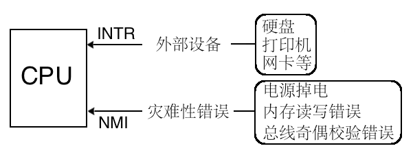

## 7.1 中断是什么，为什么要有中断
###  7.1.1 中断是什么
- **中断处理(也称为中断):**由于 CPU 获知了计算机中发生的某些事，CPU 暂停正在执行的程序，转而去执行处理该事件的程序，当这段程序执行完毕后，CPU 继续执行刚才的程序
- 提升整个系统利用率最有效的方式
   - 因为有了中断，**系统才能并发运行**
      - 单核 CPU 谈并发，多核 CPU 谈并行

###  7.1.2 为什么要有中断


#### 🧠 一、从直觉开始：CPU 本来是“傻的”

CPU 的本质，就是按照程序顺序一条一条执行指令：

```c
while(1){
    do_A();
    do_B();
    do_C();
}
```

👉 它不会主动“知道外部发生了什么”。
比如：

* 键盘按下了？
* 定时器到了？
* 网络数据来了？

CPU 自己是不会知道的。

---

🚫 如果没有中断，会怎样？

假设没有中断机制，CPU 想要知道键盘有没有输入，
就只能不停地 **轮询（polling）**：

```c
while(1){
    if (keyboard_has_input()) {
        handle_key();
    }
}
```

问题是：

* 99.9% 的时间键盘没有输入；
* CPU 还在“白忙活”地循环检查；
* 导致 CPU 资源浪费、性能极低。

🧩 这叫做 **“忙等待（busy waiting）”**。

---

#### 二、有了中断之后……

有了中断机制，外设可以**主动通知 CPU**：

* 键盘按下 → 产生中断信号 → CPU 自动打断当前工作；
* CPU 暂停当前任务；
* 跳转执行对应的中断处理程序；
* 处理完之后自动回去继续执行。

👉 这样 CPU 就不必“傻傻地等”，而是“被动响应事件”。


💡 这其实就是**事件驱动机制**的原型。
中断 = “硬件级的事件回调”。

---


## 7.2 操作系统是中断驱动的

##  7.3 中断分类

| 分类角度  | 类型                | 举例              | 特点          |
| ----- | ----------------- | --------------- | ----------- |
| 来源    | 硬件中断 / 软件中断       | 键盘中断 / int 0x80 | 来源不同        |
| CPU视角 | 外中断 / 内中断         | IRQ1 / 除零       | 是否来自 CPU 内部 |
| 可屏蔽性  | 可屏蔽 / 不可屏蔽        | 时钟 / 电源故障       | 能否禁止        |
| 处理方式  | 异常 / 陷阱 / 故障 / 终止 | 页错误 / 调试 / 段错误  | 可恢复性不同      |


- **Linux** 把中断分为上半部和下半部分开处理。
   - 操作系统是中断驱动的，中断发生后会执行相应的**中断处理程序**
   - **上半部**  
       - 需要立即执行的部分
       - **关中断**不被打扰的情况下执行
    - **下半部**  
       - 不紧急的部分
       - **开中断**的情况下执行

### 7.3.1  外部中断
**外部中断是指来自 CPU 外部的中断，而外部的中断源必须是某个硬件，所以外部中断又称为硬件中断。**

- 可屏蔽中断
- 不可屏蔽中断
    
### 7.3.2  内部中断
**内部中断可分为软中断和异常。**
- 软中断
- 异常
    | 类型     | 英文名   | 说明                         | 示例                   | 是否可恢复  |
    | ------ | ----- | -------------------------- | -------------------- | ------ |
    | **故障** | Fault | 在指令执行前或执行中出现问题，修复后可重新执行该指令 | 除零错误、页错误（Page Fault） | ✅ 可恢复  |
    | **陷阱** | Trap  | 在指令执行后触发，用于调试、系统调用         | 单步调试（INT 3）          | ✅ 可恢复  |
    | **终止** | Abort | 严重错误，无法恢复                  | 总线错误、硬件失效            | ❌ 不可恢复 |


## 7.4 中断描述符表
